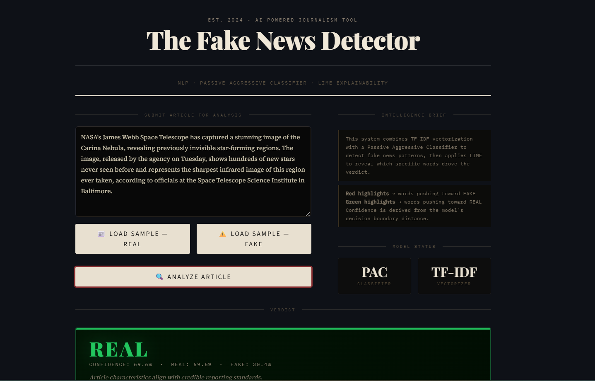

# Fake News Detection System

> An interpretable machine learning system that classifies news articles as **Real** or **Fake** — and explains *why* using LIME (Local Interpretable Model-agnostic Explanations). Built with scikit-learn, spaCy, and Streamlit.


---

## Features

| Feature | Details |
|---|---|
| Text Classification | Passive Aggressive Classifier on TF-IDF vectors |
|  Confidence Score | Sigmoid-transformed decision function → probability estimate |
|  LIME Explainability | Word-level influence scores with color-coded highlighting |
|  Zero-download Setup | Built-in 50-sample balanced dataset — works instantly |
|  Persistent Model | Trained once, saved to disk — no retraining on every run |
|  Editorial UI | Dark newsroom aesthetic with Streamlit |

---

## Project Structure

```
fake-news-detector/
│
├── app.py            # Streamlit UI — layout, styling, orchestration
├── model.py          # Pipeline build, training, prediction, persistence
├── explain.py        # LIME explainer, text annotator, HTML highlighter
├── data_loader.py    # Dataset loading (sample / CSV / LIAR)
├── models/           # Saved model pickle files (auto-created)
│   └── fake_news_model.pkl
├── assets/           # Static assets (placeholder)
├── requirements.txt
└── README.md
```

---

##  Quick Start

### 1. Clone & enter the project
```bash
git clone https://github.com/yourname/fake-news-detector.git
cd fake-news-detector
```

### 2. Create a virtual environment
```bash
python -m venv venv
source venv/bin/activate        # macOS / Linux
venv\Scripts\activate           # Windows
```

### 3. Install dependencies
```bash
pip install -r requirements.txt
```

### 4. (Optional) Pre-train the model
The app auto-trains on first run, but you can train explicitly:
```bash
python model.py                          # train on built-in sample dataset
python model.py --data path/to/data.csv  # train on your own CSV
python model.py --retrain                # force retrain from scratch
```

### 5. Launch the app
```bash
streamlit run app.py
```

Open `http://localhost:8501` in your browser. 🎉

---

##  Using Your Own Dataset

### Option A — CSV file
Your CSV must have at least two columns:

```
text,label
"Scientists discover new exoplanet...",REAL
"Government putting mind control chemicals...",FAKE
```

Labels can be: `REAL/FAKE`, `0/1`, `TRUE/FALSE` (case-insensitive).

```bash
python model.py --data path/to/fake_news.csv
```

### Option B — LIAR Dataset
1. Download from: https://www.cs.ucsb.edu/~william/data/liar_dataset.zip
2. Extract the `.zip` to a folder, e.g. `data/liar/`
3. Run:
```bash
python model.py --data data/liar/
```

### Option C — Kaggle Fake News Dataset
1. Download `train.csv` from [Kaggle Fake and Real News](https://www.kaggle.com/clmentbisaillon/fake-and-real-news-dataset)
2. Merge fake and real CSVs, ensure columns are `text` and `label`
3. Load as a CSV (Option A)

---

##  How It Works

### 1. Data Preprocessing (`data_loader.py`)
Raw text is cleaned: lowercased, HTML stripped, URLs removed, non-alpha characters filtered.

### 2. TF-IDF Vectorization
Word unigrams and bigrams are extracted with `TfidfVectorizer`:
- `max_features=60,000` — vocabulary cap
- `sublinear_tf=True` — log-scaled term frequencies
- `ngram_range=(1,2)` — captures phrases like "breaking news", "confirmed sources"

### 3. Passive Aggressive Classifier
A margin-based online learning algorithm that:
- Updates only on misclassified (passive on correct, aggressive on wrong)
- Efficient for large text datasets
- Regularization via `C` parameter controls aggressiveness

### 4. Confidence Estimation
`PassiveAggressiveClassifier` has no `predict_proba`. We convert the raw decision function score through a **sigmoid function**:

```
P(FAKE) = 1 / (1 + exp(-decision_score))
```

### 5. LIME Explanation (`explain.py`)
LIME works by:
1. Creating ~400 perturbed versions of the input (randomly masking words)
2. Getting the model's prediction on each perturbed version
3. Fitting a weighted linear model to identify which words most influenced the prediction
4. Returning per-word weights as influence scores

Words with **positive weight** → push toward FAKE  
Words with **negative weight** → push toward REAL

---

##  UI Overview

The app uses an editorial **dark newsroom** aesthetic:
- **Masthead** — newspaper-style header with serif typography
- **Verdict Card** — color-coded REAL/FAKE stamp with confidence bar
- **Highlighted Article** — inline word highlighting with opacity scaling
- **LIME Word Bars** — ranked influence bars for top positive/negative words
- **Raw Data Expander** — full LIME feature weights table
- 

---

##  Tech Stack

| Layer | Library |
|---|---|
| UI | Streamlit |
| Vectorization | scikit-learn `TfidfVectorizer` |
| Classifier | scikit-learn `PassiveAggressiveClassifier` |
| Explainability | LIME `lime_text.LimeTextExplainer` |
| Data | pandas, numpy |
| Persistence | Python `pickle` |

---

##  Limitations

- The built-in sample dataset has 50 examples — suitable for demonstration, not production.
- For production use, train on a large labeled dataset (e.g., LIAR, FakeNewsNet, Kaggle).
- Confidence scores are approximations derived from decision boundary distance.
- LIME explanations are stochastic — slight variation is expected between runs.

---

##  Contributing

1. Fork the repository
2. Create a feature branch: `git checkout -b feature/better-dataset`
3. Commit and push your changes
4. Open a Pull Request

---

##  License

MIT © 2024 — Free to use for research, education, and personal projects.
